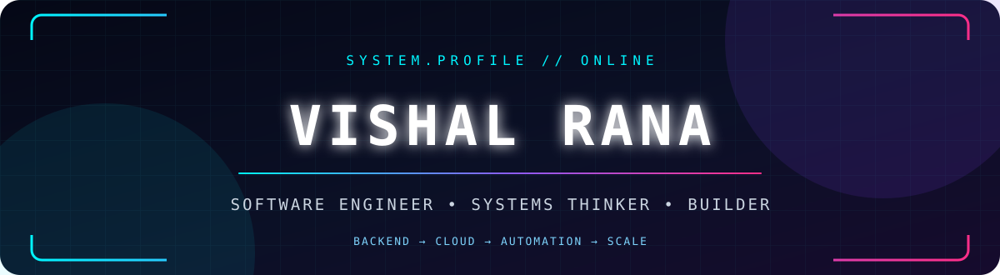
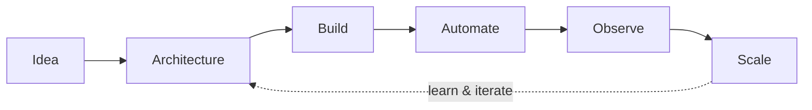

<div align="center">



`I design systems that survive the real world.`

<p>
  <a href="https://chela.io"></a>
  &nbsp;
  <a href="mailto:vishalrana9915@gmail.com"></a>
</p>

</div>

```console
vishal@dev:~$ whoami
Software engineer who enjoys architecture, distributed systems,
servers, automation, and the hard problems hiding between them.

vishal@dev:~$ current_mission
Building Chela · Exploring AI-native development · Shipping useful things
```

## `> system.profile`

```yaml
name: Vishal Rana
role: Software Engineer
location: India
focus:
  - Scalable backend architecture
  - Distributed systems & event-driven workflows
  - Cloud infrastructure & developer automation
  - Fast, thoughtful product engineering
currently_building: Chela
learning_mode: "Vibe coding — with engineering discipline"
ask_me_about: [Node.js, React, Redis, SQL, NoSQL, Queues]
```

## `> architecture.toolbox`

<div align="center">

| `CORE` | `DATA + MESSAGING` | `CLOUD + DELIVERY` | `INTERFACE + QUALITY` |
|:---:|:---:|:---:|:---:|
| JavaScript | PostgreSQL | AWS | React |
| TypeScript | MySQL | GCP | Angular |
| Node.js | MongoDB | Docker | GraphQL |
| Go | Redis | NGINX | Jest |
| Express | RabbitMQ | Jenkins | Postman |
| Bash | SQL + NoSQL | Linux + Git | Chart.js |

</div>



## `> build.protocol`

| 01 — ARCHITECT | 02 — SHIP | 03 — OPERATE | 04 — EVOLVE |
|:---|:---|:---|:---|
| Model the system and its failure modes | Build the smallest durable solution | Automate, observe, and remove toil | Learn from reality and iterate |

Explore my repositories, contribution history, and current experiments directly on [my GitHub profile](https://github.com/vishalrana9915).

## `> open.channels`

<div align="center">

[`LINKEDIN // CONNECT`](https://www.linkedin.com/in/vishal-rana-b5b53b125/) ·
[`MEDIUM // READ`](https://medium.com/@vishalrana9915) ·
[`LEETCODE // SOLVE`](https://www.leetcode.com/r_vishal95) ·
[`HACKERRANK // CODE`](https://www.hackerrank.com/vishal_rana9915) ·
[`PORTFOLIO // EXPLORE`](http://vishalrana9915.wixsite.com/info) ·
[`EMAIL // SAY HELLO`](mailto:vishalrana9915@gmail.com)

I write about software, architecture, and lessons from building in public on [Medium](https://medium.com/@vishalrana9915).

<br />

> **Good systems feel simple on the outside because someone embraced the complexity inside.**


</div>
